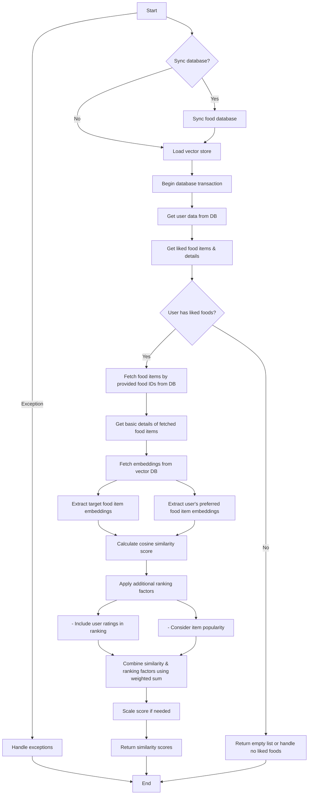

# Food Recommendation Engine
## Data Cleaning Flow
```mermaid
flowchart TD
    A[14M data points] --> B(Divide it into chunks keeping 50k items in a chunk)
    B --> C{check if any chunk is pending for processing}
    C --> |Yes| D(filter out non-food items from the chunk using fbBart classification model) # https://github.com/GoogleCloudPlatform/generative-ai/blob/main/language/prompts/examples/text_classification.ipynb

    D --> E(Pass the chunk with only food item for further processing)
    E --> F(Divide the chank into batches keeping 4 items in a batch)
    F --> G{check if any batch is pending for processing}
    G -->|Yes| H(Collect FoodCategory, FoodItemName, FoodInfo for each food item of the batch)
    G -->|No| C
    H --> I[Collect the infomation wich we need to generate:  FoodInfo, tags or classify: Dietary, FoodPreparationStyles, FoodPresentation, FoodConcepts, Flavortype, Mealtime] #https://github.com/GoogleCloudPlatform/generative-ai/blob/main/language/prompts/examples/text_classification.ipynb
    I --> J[Prepare a propmt using the food informations and pass it to PHI3-mini-128k-instruct model]
    J --> K(collect following information from the model: FoodInfo, tags, Dietary, FoodPreparationStyles, FoodPresentation, FoodConcepts, Flavortype, Mealtime)
    K --> L[Join all the chunks together into a combined data]

    L --> M[Import the combined data into the database for the recommendation system]
    
    M --> N[End]
    C --> |No| N
```

## Flow chart for syncing the My-SQL food db with Vector DB
```mermaid
flowchart TD
    %% Start and End nodes
    A[Start] --> B{Is food_id provided?}

    %% Food ID conditional branches
    B -->|No| C[Query all foods from the schema database]
    B -->|Yes| D[Query specific food by food_id]

    %% Processing all foods
    C --> E[Are there any foods in the database?]
    E -->|No| F[Return False and End]
    E -->|Yes| G[Generate basic food details for all foods]

    %% Processing specific food
    D --> H[Generate basic food details for the specific food]

    %% Merging results
    G --> I[Prepare food responses]
    H --> I[Prepare food responses]

    %% Vector store operations
    I --> J[Initialize embedding model] # https://cloud.google.com/vertex-ai/generative-ai/docs/embeddings/get-text-embeddings # https://console.cloud.google.com/vertex-ai/publishers/google/model-garden/textembedding-gecko?project=evocative-line-415907 
    J --> K[Create documents and IDs]
    K --> L[Split documents and IDs into batches]

    %% Batch processing loop
    L --> M{For each batch}
    M -->|Yes| N[Compute embeddings for batch]
    N --> O[Upsert batch into vector database] # for vector database https://cloud.google.com/vertex-ai/docs/vector-search/overview # https://console.cloud.google.com/vertex-ai/publishers/google/model-garden/textembedding-gecko?project=evocative-line-415907
    O --> P[Next batch]

    %% Deletion step
    M -->|No more batches| Q{Is any food_id found which is in the vector db but not in provided input food list??}
    Q -->|No| R[Identify outdated entries]
    R --> S[Delete outdated entries]

    %% Final steps
    Q -->|Yes| T[Skip deletion]
    S --> U[Return True and End]
    T --> U[Return True and End]

    %% Batch processing loop back
    P --> M

```

## Flow chart for getting top n food recommendation depending of user preferrence food item 
```mermaid
flowchart TD
    A[Start] --> B{Sync database?}

    B -->|Yes| C[Sync food database]
    B -->|No| D[Load vector store]

    C --> D

    D --> E[Begin database transaction]

    E --> F[Get user data from DB]
    F --> G[Get liked food items & details]

    G --> H{User has liked foods?}
    H -->|No| I[Return False]
    H -->|Yes| J[Load vector store]


    J --> K[Fetch embeddings from vector DB] # https://cloud.google.com/bigquery/docs/vector-search-intro # https://github.com/GoogleCloudPlatform/generative-ai/blob/main/gemini/use-cases/retrieval-augmented-generation/rag_qna_langchain_bigquery_vector_search.ipynb
    K --> L[Extract user's preferred food item embeddings]
    L --> M[Query in the vectort DB to fetch the top 'n' similer food items]
    M --> N[Extract top 'n' similer food embeddings]

    N --> O[Calculate cosine similarity score] # in BQ vectorsearch we have other options as well # https://cloud.google.com/spanner/docs/choose-vector-distance-function
    L --> O
    O --> P[Apply additional ranking factors]
    P --> P1[ - Include user ratings in ranking]
    P --> P2[ - Consider item popularity]
    P1 --> Q[Combine similarity & ranking factors using weighted sum]
    P2 --> Q
    Q --> R[Scale score if needed]
    R --> S[Sort recommendations by score descending]
    S --> T[Format recommendations]

    T --> U{Update database?}
    U -->|No| V[Return recommendations]
    U -->|Yes| W{Are there recommendations?}
    W -->|No| X[Return False]
    W -->|Yes| Y[Format data payload]

    Y --> Z[Delete previous recommendations]
    Z --> AA[Insert recommended foods into database]

    AA --> AB[Return True]

    A -->|Exception| AC[Handle exceptions]

    AC --> AD[End]
    AB --> AD[End]
    V --> AD
    X --> AD

```


## Flow chart for getting the similarity score between list of target food and user preferred foods
